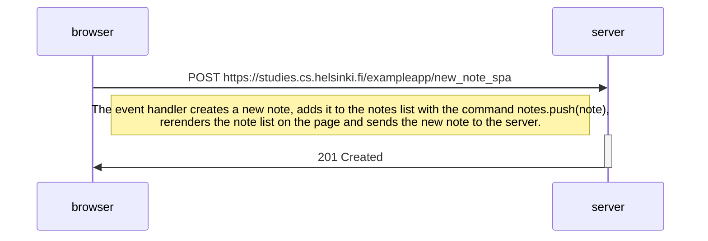

```mermaid
  sequenceDiagram
    participant browser
    participant server

    browser->>server: POST https://studies.cs.helsinki.fi/exampleapp/new_note_spa

    Note right of browser: The event handler creates a new note, adds it to the notes list with the command notes.push(note),<br> rerenders the note list on the page and sends the new note to the server.

    activate server
    server->>browser: 201 Created
    deactivate server

   
```
